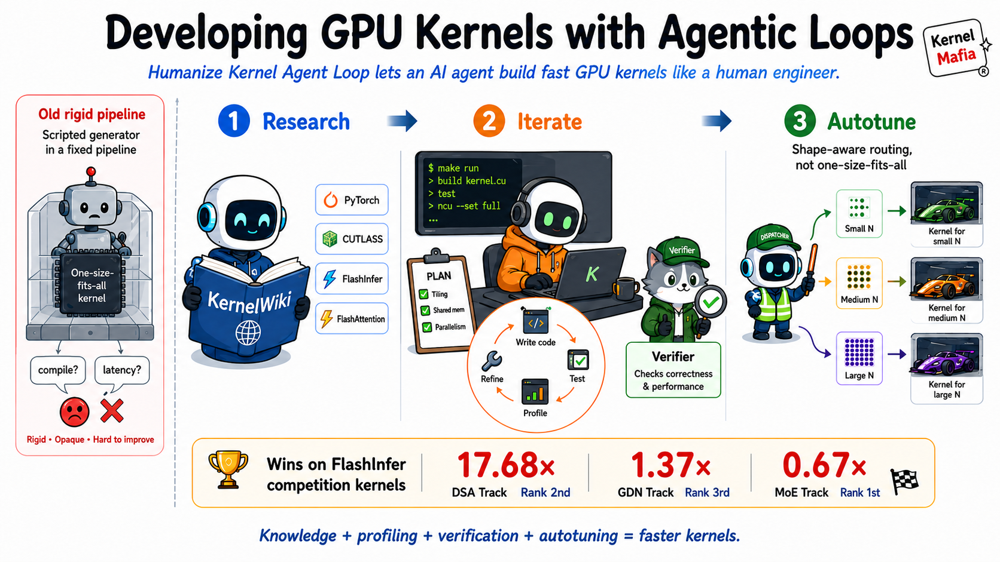
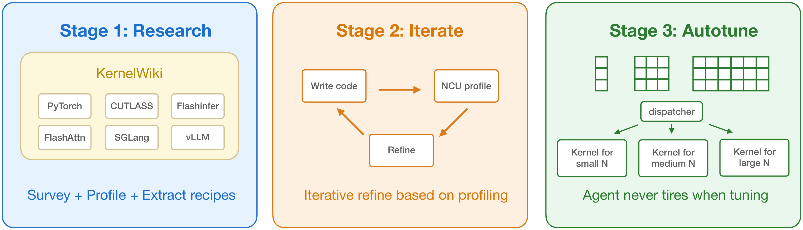
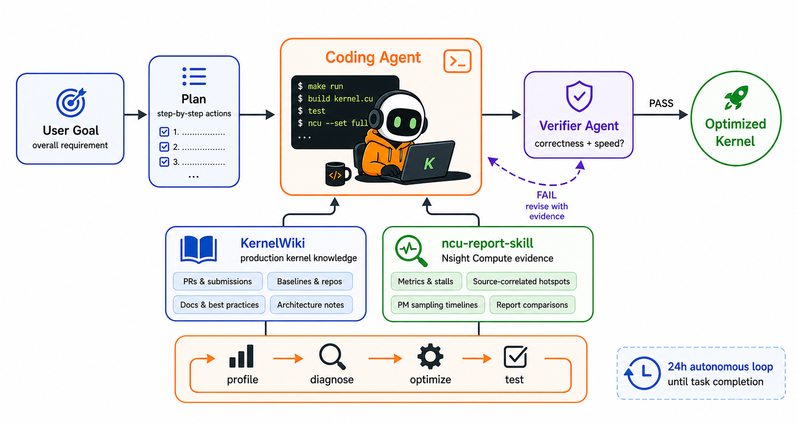
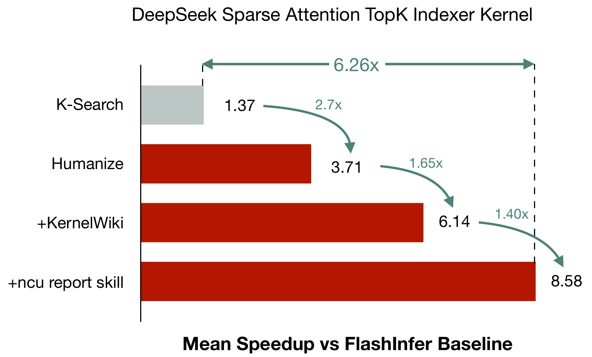

# HAN Lab Kernel Mafia MLSys2026 Flashinfer Constest Release

This repository releases the prompts, workflow documentation, and a minimal verification example for our MLSys 2026 FlashInfer Full-Agent track effort. The submitted kernels were produced by a fully agent-driven optimization workflow with [KDA (Kernel Develop Agents)](https://github.com/mit-han-lab/kernel-design-agents). The core methods are [Humanize](https://github.com/PolyArch/humanize) (the best harness framework), [Our Collected KernelWiki](https://github.com/DongyunZou/KernelWiki/tree/master), and [Nsight Compute Profile Skills](https://github.com/DongyunZou/ncu-report-skill).

* Team: HAN Lab Kernel Mafia
* Technical Report: [docs/HAN_Lab_Kernel_Mafia_Technical_Report](docs/HAN_Lab_Kernel_Mafia_Technical_Report.pdf)
* Generated Kernels / Final solution: [mit-han-lab/mlsys2026-flashinfer-contest-solution](https://github.com/mit-han-lab/mlsys2026-flashinfer-contest-solution)



The repository is intentionally small. It contains documentation, agent prompts, and a lightweight `flashinfer-bench` verification example for an externally packed `solution.json`. Final kernel source snapshots and the submission verification harness live in the separate submissions repository linked above. The reusable skills remain in their own repositories and are linked below.

## Competition Results

Our agent workflow shows impressive results in all three Full-Agent Approach tracks of the MLSys 2026 Competition NVIDIA Track:

| Track | Result |
|---|---:|
| MoE Track | 1st place |
| DSA Track | 2nd place |
| GDN Track | 3rd place |

The released prompts follow a three-stage optimization workflow:



Each stage uses the Humanize planning and RLCR loop to turn a phase prompt into an executable optimization plan:



## Skill Ablation

This ablation was run after the competition, separately from the official contest submissions, so its numbers are meant to explain skill contributions rather than exactly match the competition results above. The skill ablation highlights that Humanize is the dominant contributor: it gives the agent a much stronger plan-execute-verify structure, turning each optimization attempt into a more disciplined loop instead of a loose sequence of trials. KernelWiki broadens the kernel knowledge the agent can consult, and `ncu-report-skill` lets the agent read finer-grained profiler evidence instead of relying only on benchmark scores as a black box. Those two skills are useful, but the largest and most central gain comes from Humanize.



## Contents

| Path | Purpose |
|---|---|
| `verify.py` | Minimal example that evaluates one packed FlashInfer `solution.json` with `flashinfer-bench`. |
| `prompts/` | Prompt template and task-specific prompts used for the agent workflow. |
| `skills/` | Git submodule links to the required Claude skills. |
| `docs/HAN_Lab_Kernel_Mafia_Technical_Report.pdf` | Technical report. |
| `docs/reproduction.md` | Environment, dataset, and benchmark reproduction notes. |

## Agent Workflow Dependencies

The workflow depends on Claude Code and Codex. Install `humanize` as a Claude Code plugin, and install `KernelWiki` and `ncu-report-skill` as Claude skills under `~/.claude/skills/`.

This repository links the two required skills as git submodules under `skills/` so they are visible in the release tree. If you did not clone with `--recurse-submodules`, initialize them from the repository root:

```bash
# link skills
git submodule update --init --recursive
mkdir -p ~/.claude/skills
ln -sfn "$PWD/skills/KernelWiki" ~/.claude/skills/KernelWiki
ln -sfn "$PWD/skills/ncu-report-skill" ~/.claude/skills/ncu-report-skill

# or clone skills directly
mkdir -p ~/.claude/skills && cd ~/.claude/skills
git clone https://github.com/mit-han-lab/ncu-report-skill.git
git clone https://github.com/mit-han-lab/KernelWiki.git
```

Install `humanize` separately from Claude Plugin Marketplace
```bash
# Add PolyArch marketplace
/plugin marketplace add PolyArch/humanize
# Then install humanize plugin
/plugin install humanize@PolyArch
```

## Fresh Workflow Setup

Clone this repository, install the benchmark environment, download the FlashInfer contest workloads, and prepare the agent workflow dependencies:

```bash
git clone --recurse-submodules https://github.com/mit-han-lab/mlsys2026-flashinfer-contest.git
cd mlsys2026-flashinfer-contest

git clone https://github.com/flashinfer-ai/flashinfer-bench.git /tmp/flashinfer-bench-main
uv sync --python 3.12

# uv.lock pins the contest-tested stack:
# flashinfer-python==0.6.8.post1, torch==2.12.0+cu132, triton==3.6.0.
# Use Python 3.12 or 3.13; Python 3.14 is not supported by all CUDA wheels.

# Required by some baselines and generated solutions that use DeepGEMM/CUTLASS/CuTe headers.
git clone https://github.com/deepseek-ai/DeepGEMM.git /tmp/DeepGEMM
uv pip install -e /tmp/DeepGEMM --no-build-isolation

uv run ./scripts/download_data.sh
```

Confirm that the workload dataset is visible:

```bash
uv run python -c "from flashinfer_bench import TraceSet; ts = TraceSet.from_path('data/flashinfer-trace'); print(sorted(ts.definitions)); print(sum(len(v) for v in ts.workloads.values()), 'workloads')"
```

Create a separate task implementation workspace from the official FlashInfer starter kit, then start the agent from there. This repository is the prompt/workflow release; do not implement kernels directly in this repository.

```bash
mkdir -p workspaces
git clone https://github.com/flashinfer-ai/flashinfer-bench-starter-kit.git workspaces/<task-name>
cd workspaces/<task-name>
export FIB_DATASET_PATH="$OLDPWD/data/flashinfer-trace"
```

Then choose a task prompt under `prompts/`, start a fresh agent session in the task implementation workspace, and paste the selected phase prompt. The released final kernels are not part of this workflow and must not be used as implementation input.

See `docs/reproduction.md` for full environment notes and packed-solution verification commands.

By default, the dataset is stored under `data/flashinfer-trace` inside this repository. Override it with:

```bash
export FIB_DATASET_PATH=/path/to/flashinfer-trace
```

## Release Boundary

Final kernels are stored only in [mit-han-lab/mlsys2026-flashinfer-contest-solution.git](https://github.com/mit-han-lab/mlsys2026-flashinfer-contest-solution.git) as result snapshots. This link is for release provenance and final-result verification; it is not an input to the prompt-driven agent workflow. Agents MUST NOT clone or inspect the release repository while solving the tasks. Intermediate candidates, benchmark histories, and search DAGs are not part of this release. The prompts in `prompts/` are meant to be run from a separate task implementation workspace created from the official FlashInfer starter kit. We do not place final kernels inside an agent starting workspace.

Running the full Agents workflow is not bitwise deterministic: search order, profiling noise, GPU scheduling, and model behavior can change. The external submissions repository is the source of truth for the released final kernel snapshots.
